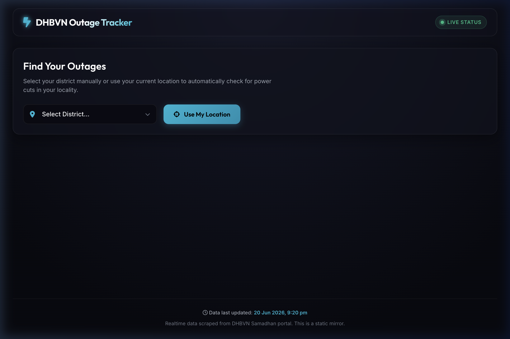
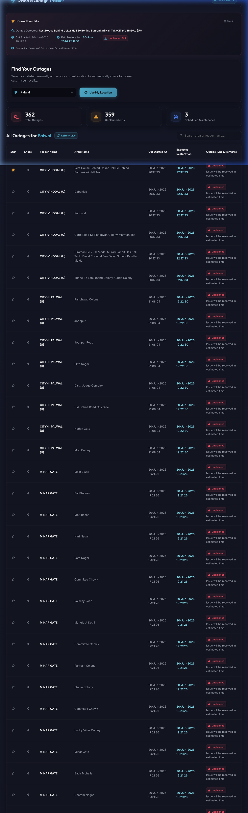
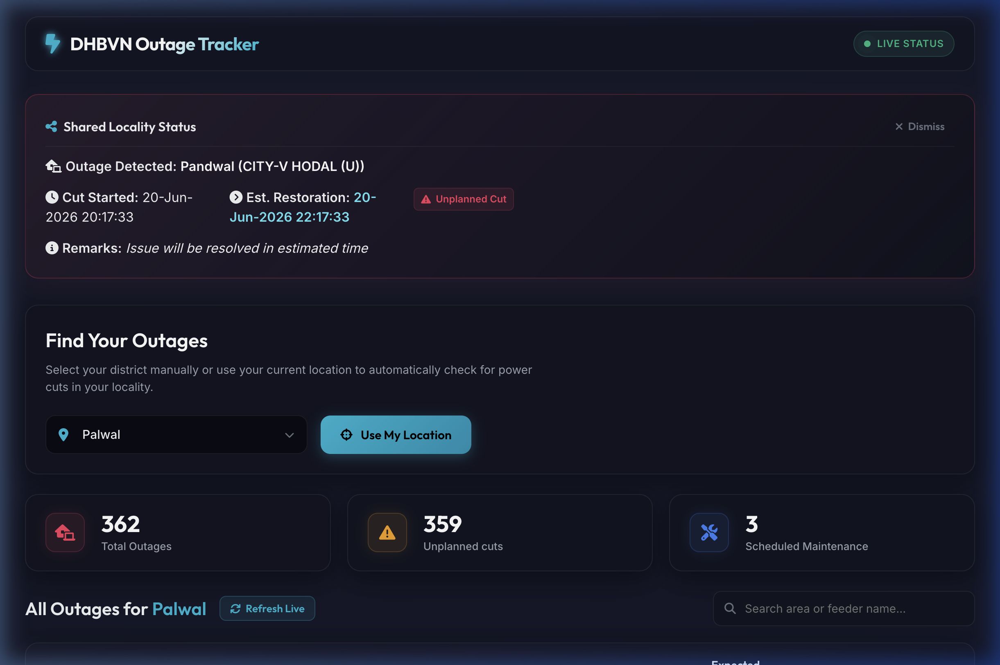

# Palwal(Haryana) Power Outage Tracker — Live DHBVN Updates

A premium, interactive web application to track live power outages, scheduled maintenance, and estimated restoration times for all 12 districts under the **Dakshin Haryana Bijli Vitran Nigam (DHBVN)**. 

🔗 **Live Website**: [https://mandy321.github.io/haryana-dhbvn-electricity-status/](https://mandy321.github.io/haryana-dhbvn-electricity-status/)

---

## Visual Previews

### 1. Dashboard Landing (Manual Selection & GPS Geocoding)


### 2. Pinned Locality (Star Pinning)


### 3. Shared Locality Status (WhatsApp Share Link Handler)


---

## Key Features

1. **Auto-Location Detection (GPS)**: Detects your current coordinates, reverse-lookup matches your district (e.g. Gurugram, Palwal, Jind), and highlights active power cuts in your exact suburb or village name.
2. **Interactive SVG Heatmap (Visual Overhaul)**: Features an optimized, clickable SVG district map of Haryana. Districts are color-coded dynamically based on active outage counts:
   * 🟢 **Green (All Clear)**: 0 outages
   * 🟡 **Yellow (Minor)**: 1-5 outages
   * 🔴 **Red (Major)**: >5 outages/feeders down
   * Hovering displays a floating tooltip with real-time status details, while clicking highlights the district. Non-DHBVN districts (UHBVN area) are dimmed out.
3. **On-Demand Live Refresh**: Instantly updates outages for your selected district directly from the DHBVN servers via a CORS proxy.
4. **High-Impact District Status Banner & Grid Health**: Displays a dynamic status badge ("ACTIVE" pulsing red/orange or "ALL CLEAR" glowing green) along with unique "Feeders Down" and total "Areas Affected" counts. Includes an **Electricity Up %** health bar comparing active outages to a compiled baseline of total feeders/areas.
5. **Outage Severity Filtering**: Classifies cuts into Major (>=4h), Moderate (2h-4h), and Minor (<2h) with a lightweight, CSS-only hover explanation tooltip.
6. **Average Restoration Time (ART) Score**: Calculates the average fix time over the last 7 days from historical restoration logs, displayed in a glowing status box.
7. **Most Unreliable Feeders (Hotspot Leaderboard)**: Ranks all feeders in the district by total outages over the last 14 days, featuring a trophy trophy icon next to the worst-performing feeder.
8. **14-Day Outage Trend Chart**: Integrates a responsive bar graph (via Chart.js) that visualizes historical daily outage trends. Bars are colored dynamically (rose/red for > 5 outages, amber/orange for <= 5 outages) and support custom dark-theme styled tooltips.
9. **District Outage Archive & Monthly Health Reports**: Keeps an incremental history of resolved outages for each district. On the 1st of every month, a automated GitHub workflow compiles a static HTML report (with month-over-month comparisons and worst week highlights) linked via a dropdown menu in the UI.
10. **CSV Data Exporter**: Allows users to export the historical archive data into an Excel/Sheets-friendly CSV format (Date, District, Feeder, Area, Start, Restoration, Remarks, Severity).
11. **Area Pinning (Star) & Web Push Notifications**: Star your specific feeder or locality to keep its status pinned at the very top of your dashboard. Supports one-click browser push alerts subscription for pinned areas utilizing a free, serverless broker (`ntfy.sh`).
12. **WhatsApp Sharing**: Easily share the real-time outage status of any specific area with a one-click generated link. When clicked, the recipient directly sees that area's status highlighted on top.
13. **Automated Scheduled Scraping**: Runs a headless browser crawler via GitHub Actions every 20 minutes to fetch and mirror DHBVN status.
14. **Premium Responsive UI**: Elegant dark space design with glassmorphism, responsive data grids, stats counters, and smooth layout transformations.

---

## Repository Structure

```
├── .github/workflows/
│   ├── scrape.yml                  # headles browser scheduler (runs every 20 mins)
│   └── monthly_report.yml          # monthly health report compiler (runs on the 1st)
├── assets/
│   ├── dashboard.png               # screenshot of dashboard landing
│   ├── pinned_final.png            # screenshot of starred pin state
│   ├── shared_state.png            # screenshot of shared link handler
│   └── haryana_districts.svg       # optimized, responsive interactive vector map
├── data/
│   ├── outages.json                # compiled active outages database
│   └── feeder_master.json          # baseline total feeders and areas per district
├── reports/
│   ├── manifest.json               # index of generated monthly report files
│   └── [month]-[year].html         # compiled static monthly grid health reports
├── scripts/
│   └── generate_monthly_report.js  # Node.js engine for monthly health compilation
├── scraper.js                      # Playwright crawler with live ntfy.sh alert hooks
├── index.html                      # frontend dashboard structure
├── style.css                       # dark theme stylesheet and interactive map overrides
├── app.js                          # frontend controller (map, reports, alerts, geocoding)
├── package.json                    # dependencies and npm script hooks
└── PROJECT_DETAILS.md              # deep-dive developer architectural walkthrough
```


---

## Local Setup & Run

### Prerequisites
- Node.js (v18 or higher)
- npm

### Installation
1. Clone the repository:
   ```bash
   git clone https://github.com/mandy321/haryana-dhbvn-electricity-status.git
   cd haryana-dhbvn-electricity-status
   ```
2. Install dependencies:
   ```bash
   npm install
   ```
3. Install browser binaries for Playwright:
   ```bash
   npm run install-browsers
   ```

### Execution
- **Run local scraper**:
  ```bash
  npm run scrape
  ```
  This crawls the DHBVN portal and outputs the fresh data to `data/outages.json`.
- **Run local web server**:
  You can host the directory using any static file server, for example:
  ```bash
  npx http-server .
  ```
  Then open `http://localhost:8080` in your web browser.

---

## Detailed Tech Walkthrough
For a deep dive into the crawler logic, reverse-geocoding area matching, and cryptographic static API headers, read [PROJECT_DETAILS.md](./PROJECT_DETAILS.md).
